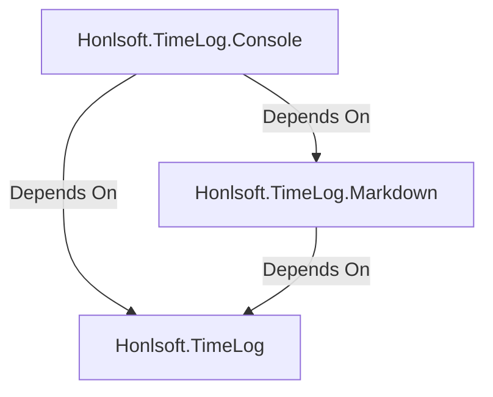

# Honlsoft Time Logger for Markdown

Takes a markdown file and parses out time entries from it.
Formats them on the Command Line, and summarizes total time entry by task.

This is not a general purpose time log watcher as the time logs are in a very specific format.

## Usage

### Docker

The easiest way to run this is to use the [Docker](https://www.docker.com/) container.

In a powershell command prompt, you can run the following command to get the latest version of the image from the github container registry.

```
docker run -it --rm -v ${PWD}:/app/logs ghcr.io/jerhon/markdown-timelog logs summary --date 2021-12-29
```

Everything after `markdown-timelog:main` are the arguments that are passed to the command.

### Log Format

Time logs must be named in the following format: `YYYY-MM-DD-log.md` where `YYYY-MM-DD` is the date of the log, and log can be replaced with anything you like.  It must have the extension .md.

Given there is a file with the current date, it will generate a summary of the time entries in the file like this:


### Markdown Time Entry Format

Time entries are placed in a markdown table similar to this shown below.
The tool will determine if the table entry is a time entry by if the first column in the table has the format of:

`HH:MM AM/PM`

or

`HH:MM AM/PM - HH:MM AM/PM`

The second column is interpreted to be a task identifier.
The application will group by the task identifier to summarize times.
The third column is interpreted to be a description of the task.

A Full example would be:

```markdown
| Time Entry | Task | Description |
|------------|------|-------------|
| 12:00 AM - 1:00 AM | Task 1 | Description 1 |
| 1:00 AM - 2:00 AM | Task 2 | Description 2 |
| 2:00 AM - 3:00 AM | Task 3 | Description 3 |
```

If an entry is missing an ending time, it will use the start time of the next entry.  Unless it is the last entry, then it will not assume any time.

For example:


```markdown
| Time Entry | Task | Description |
|------------|------|-------------|
| 12:00 AM | Task 1 | Description 1 |
| 1:00 AM | Task 2 | Description 2 |
| 2:00 AM | Task 3 | Description 3 |
```

Task 1 would go from 12:00 AM to 1:00 AM.
Task 2 would go from 1:00 AM to 2:00 AM.
Task 3 would start at 2:00 AM, but not have a defined end time.

The two can be mixed as well.
Some records could have a start and end time, and some just have a start time.
The same rules would apply.

## Output

```
                           Time Summary
52341  ███████████████████████████████████████████████████ 3
12345  █████████████████████████████████ 2
99999  ███████████████ 1
┌──────────┬───────┬───────────────┐
│ Duration │ Task  │ Description   │
├──────────┼───────┼───────────────┤
│ 02:00:00 │ 12345 │ description   │
│          │       │ description 4 │
│ 03:00:00 │ 52341 │ description 2 │
│          │       │ description 3 │
│          │       │ description 3 │
│ 01:00:00 │ 99999 │ unidentified  │
└──────────┴───────┴───────────────┘
```

## Development

The console application is contained in the `Honlsoft.TimeLog.Console` directory to build and run.
It is a typical dotnet console application.
Either open sln in your preferred IDE, or use the dotnet console like `dotnet build` and `dotnet run` to run the application.

### Project Layout

The application uses a semi-Clean Architecture approach.
The Domain and UseCases are in the main Honlsoft.TimeLog assembly and independent of most concrete technology decisions.
The Honlsoft.TimeLog.Console assembly contains the console application.
The Honlsoft.TimeLog.Markdown assembly contains logic to interact with Markdown files as a form of persistence.

This leaves the Core Domain model around time logging independent of other technology in the application.
Other persistence layers could be built from a database, or a file system, etc without changing the core domain logic or use cases.

The Console Application wires the other layers of the application together by using a IoC container and DI.
Each component in the application has a single call which registers any dependencies it implements to be used in the application.
This can be referenced in [Program.cs](.\src\Honlsoft.TimeLog.Console\Program.cs).

In this way, the core logic can use the IoC container to get concrete implementations from layers such as the Markdown layer without explicitly knowing about it.



### ITimeSheetRepository Example

For example in order to retrieve a timesheet, in the Domain, an interface is defined `ITimeSheetRepository` with a single call that will return a TimeSheet based on the date.

This `ITimeSheetRepository` is used by the UseCases to retrieve a timesheet.
However, an implementation is not made by the domain.
That is implemented by a separate component that deals with reading a Markdown file and providing the time sheet associated with it.

The UseCases always use the `ITimeSheetRepository` interface to retrieve a time sheet, and not a concrete implementation.  In this way, the domain can be decoupled from whatever persistence layer is used.
Theoretically a database could be used to store the information, or it could be retrieved via a REST API.

## Use Cases

Use cases are implemented using MediatR, using a class-per-use-case approach.
To execute a use case, the application needs to send the request type to the IMediator interface, and it will get the appropriate response.
Use cases are automatically registered in the IoC container, no additional work needs to be done there.